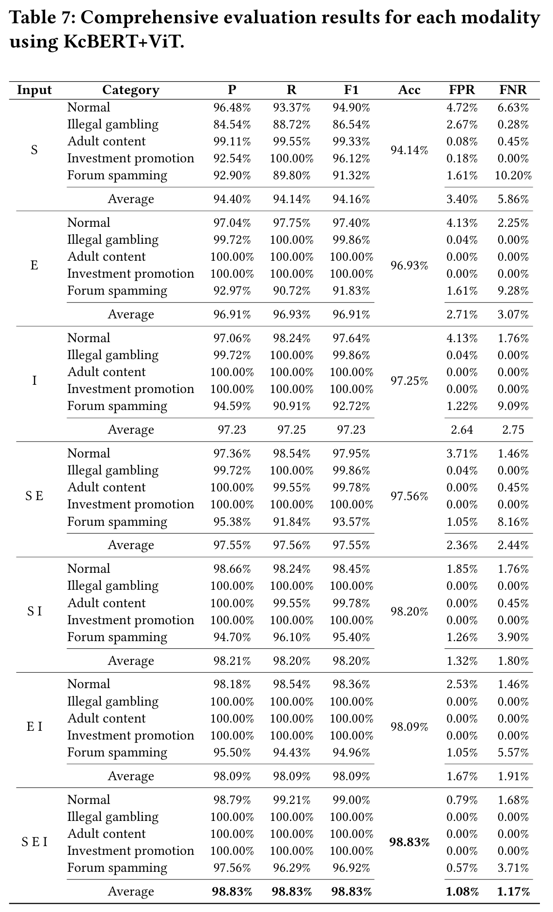

# MD-SRA

In this project, we propose a novel multimodal framework, **M**ultimodal **D**etection of **S**EO-based **R**edirection **A**ttacks (`MD-SRA`), that detects malicious SEO-based redirection chains.

- We collect three sources from a redirection chain: 
  - (1) the initial HTML source where redirection is triggered
  - (2) the HTML of the final landing page
  - (3) the screenshot of the rendered destination.
- We design and apply `Redirect Feature Fusion` (RFF) module and `Cross-Attention Block` (CAB) to extract redirection features and effectively embed inter-modal relationships.

### Framework Overview

- This is the overview of our framework, `MD-SRA`. We effectively integrate textual and visual features from the initial web page (*Initial HTML*) and the landing page (*Final HTML*), and finally a screenshot of the final landing page (*Screenshot Image*).
- We perform data crawling using the `Google Selenium Chrome Webdriver` and `undetected-chromedriver` to avoid bot detection.
- We embed the collected data using various text and image encoders.
- We perform `Cross-Attention` using two `Cross-Attention Block`, focusing on the *end* content.
- Final predicion is obtained through the final FFN Classifer.

### Redirection Overview
<div style="text-align: center;">
  
</div>

- This figure illustrates the overview of process of an redirection process.
- An adversary intrudes an web server infrastructure and injects malicious code or scripts that initiate redirection.
- Various SEO manipulation campaigns or redirection execution is performed at this stage.
- A crawler from a search engine crawls content from the compromised server. However, benign web content is rendered and therefore it is brough to the user.
- However, upon user interaction, the malicious code redirects the web user to their illegal online gambling site.


# Structure
```
REDIRECTION/
├── data/
├── pt_data/
│ ├── koclip_pt_start/
│ ├── koclip_pt_end/
│ ├── koclip_pt_image/
│ ├── kcbert_pt_start/
│ ├── kcbert_pt_end/
│ ├── koelectra_pt_start/
│ ├── koelectra_pt_end/
│ ├── vit_pt_img/
│ ├── resnet_pt_img/
├── logs/
├── checkpoints/
├── utils/
│ ├── dataset.py
│ ├── metrics.py
│ ├── models.py
│ ├── tokenize_end.py
│ ├── tokenize_img.py
│ ├── tokenize_start.py
├── README.md
├── requirements.txt
├── main.py
├── run_all.sh
├── test_all.sh
```


# Get Started
1. Create an virtual environment with Python 3.12 and install the required packages in `requirements.txt`.
```
pip install -r requirements.txt
```
2. Place your dataset in the `/data` folder.
3. Pre-embed the collected data using the following executions. The following encoders are used in this stage:
- Text Encoders: KcBERT, KoELECTRA, KoCLIP
- Image Encoders: ViT, ResNet, KoCLIP
```
./run_all_embeddings.sh
```
4. Next, train the model by executing the code included in the `run_all.sh` file.
```
./run_all.sh
```
- The results will be saved in the `/logs` file.
- The best models will be saved in the `/checkpoints` folder.

# Dataset
## 1. Dataset Overview
Details of the dataset is presented here.
- We curate a high-quality dataset of 14,160 labeled samples, categorized into five distinct classes, including illegal gambling.
- We collect 123 keywords and 14 domains, resulting 12,054 search queries.
- Dataset will be provided upon request.

<div style="text-align: center;">
  
</div>

## 2. Dataset Breakdown
Details of the dataset is presented here.


# Results
## 1. Detection Results
We evaluate our model on $D_{\text{full}}$ using six metrics (Precision, Recall, F1-Score, Accuracy, False Positive Rate (FPR), and False Negative Rate (FNR)).

<div style="text-align: center;">
  
</div>

- Our proposed framework (MD-SRA) efficiently integrates all of the given input *S E I* and performs the best achieving an F1-Score 98.83% with very low FPR and FNR.
- KcBERT+ViT performs the best.

## 2. Comprensive Results
We present the comprehensive results across five categories using KcBERT+ViT.

<div style="text-align: center;">
  
</div>

- Using all three modalities, *S E I* performs the best.

## 3. End-Focused CAB
Here, we present the effect of End-Focused CAB. We evaluate the effect of Start-Focused and Image-Focused CAB.

<div style="text-align: center;">
  
</div>


## 4. Ablation Results
Here, we present the ablation results. We evaluate the effect of RFF and CAB, respectively.

<div style="text-align: center;">
  
</div>


## 4. Embedding and Training Efficiency
Here, we present the efficiency for embedding each modality and training MD-SRA.

<div style="text-align: center;">
  
</div>


<div style="text-align: center;">
  
</div>

- The test set comprises 2,832 samples. Therefore, the inference time required per sample is very low (3.95 seconds / 2,832 $\approx$ 0.0013 seconds).
- Embedding time also takes less than one second for all modalities.
    - Using KcBERT and ViT, total time to embed requires 8,243 seconds. For a total of 14,160 samples, approximately 0.582 seconds per sample is required.
- Therefore, after data collection from web crawlers, classification can be performed in approximately 0.583 seconds, highlighting the capability for real-time detection of malicious redirection attempts.

